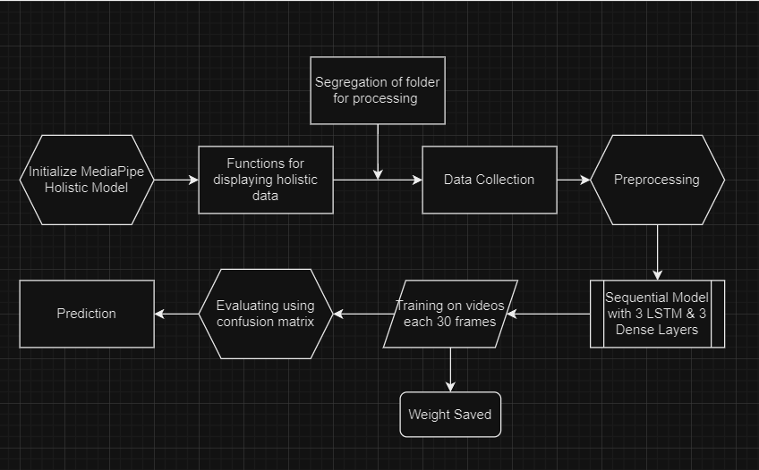
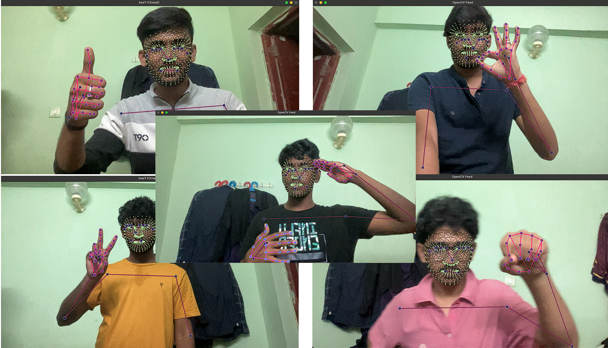

# Action Identifier

#### Action Identifier: Empowering the Needed

Action Identifier System is a powerful tool designed to automate the analysis of hand signs using LSTM Layers.



## Interactive Action Detection
Our platform offers an interactive action detection experience. It captures video frames, processes them to extract keypoints, and uses a trained LSTM model to identify specific actions.



### Key Features
#### Data Collection
The data collection process involves capturing video frames using OpenCV and processing them through MediaPipe to extract keypoints. This data is then stored for further processing.

#### Preprocessing
Before training the model, the keypoints data is normalized, split into training and validation sets, and converted into sequences suitable for LSTM input.

#### Model Building and Training
A Sequential model with LSTM and Dense layers is created using TensorFlow. The model is then compiled with appropriate loss function and optimizer and trained on the collected data. TensorBoard is used for monitoring the training process.

#### Evaluation and Prediction
The model is evaluated using metrics such as multilabel confusion matrix and accuracy score from scikit-learn. Once trained, the model can make predictions on new data to identify actions in real-time.

### Try it out

Make sure to have git installed: https://git-scm.com/

```
git clone https://github.com/Swam244/Action_Identified.git
```
Now run
```
cd Action_Identifier
pip install –r requirements.txt
```

### Technology Stack

__Tensorflow__: TensorFlow is used for building and training the Sequential model with LSTM and Dense layers.

__Open CV__: OpenCV is utilized for capturing video frames and processing images to extract keypoints.

__MediaPipe__: MediaPipe provides the holistic model for pose, face, and hand detection, enabling efficient keypoints extraction.


# My motivation - Akash

One of the projects I'm really proud of is, Action Recogntion System which helped me win a hackathon hosted by Saras AI. The motive of my project came when we saw posters with handsigns depicting International Day of Sign Languages. When me and few of my friends came across a campaign for it, we weren't able to get anything of it. Usually for languages, we could learn form one of many apps like Duolingo but I could not recall any similar apps for Sign Languages. This concided with our hackathon ideation dates as well which led me to ponder more on this. I along with 4 others, came up with various ideas but the one I had stood out the most. We then delved more into what technologies we could use and what exactly are we making a solution for. All this came down to one major challenge, identifying and classifying what a specific movement/sign is. While I had initial experience in OpenCV, I have not worked with much video modals. This led me to explore RNNs and Gated Networks in depth.

We only had a day left for giving a MVP of our solution and we already tried making basic MVP using RNN that was giving way less accuracy and was not capturing what we wanted at all. To fight this I explored Gated Networks which fought of "vanishing" and "'exploding" gradients which I assumed to be the problem.

With fast prototyping we were able to come up with a quick hackathon winning solution on which I worked with the structuring of my network, from using RNNs to LSTMs at a fast pace while my teamates worked on creating dataset ie videos, testing mediapipe's holistics and proccessing the data before sending it as inputs to my network. I was the team lead as well as the AI engineer in my team which I am really proud of.
